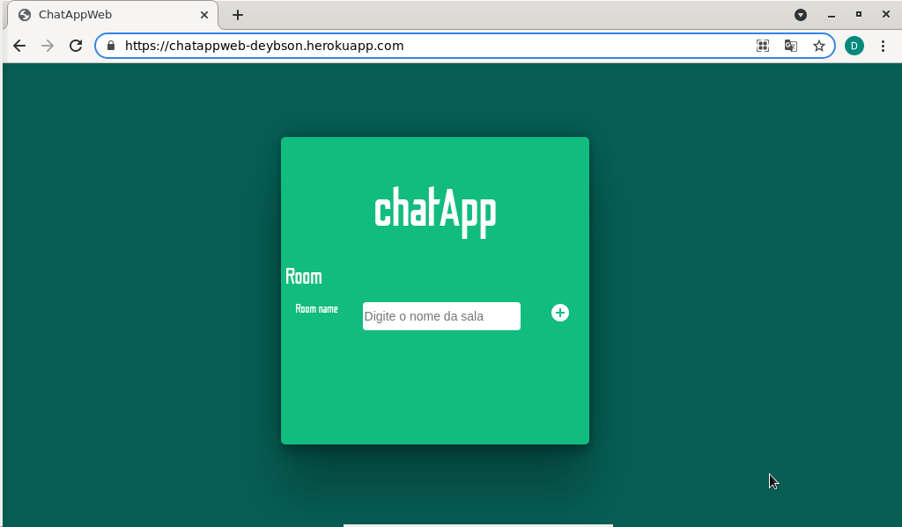
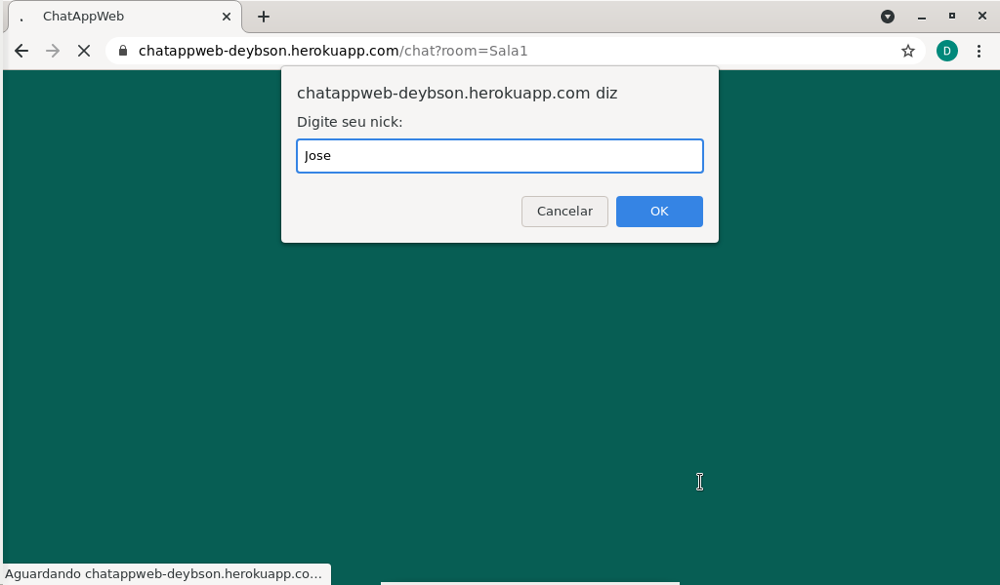
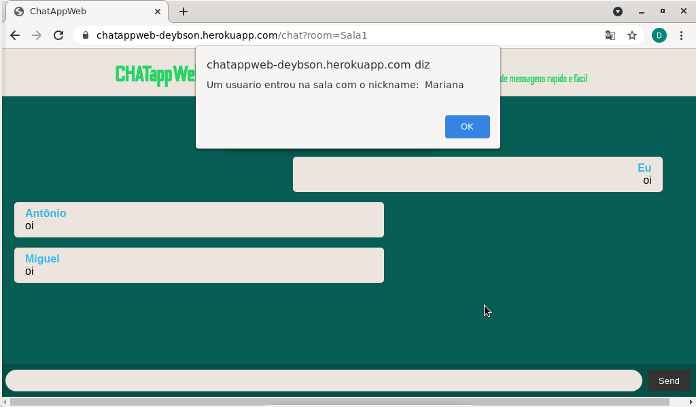
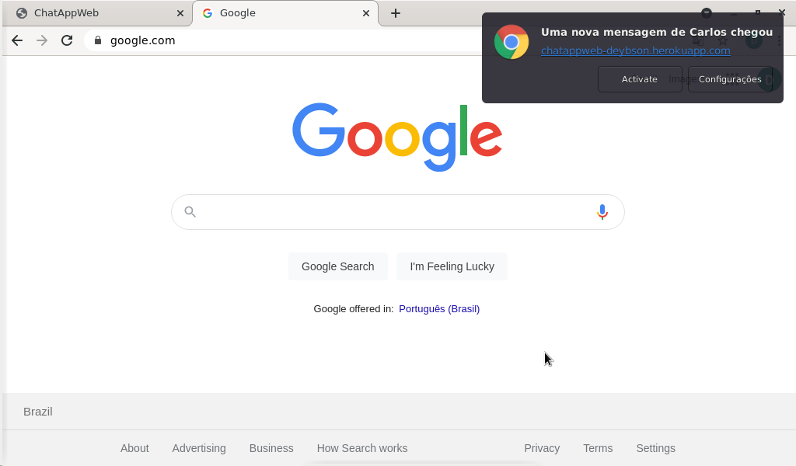

# ChatAppWeb

#### chat feito para estudo de websockets em javascript

#### link

https://chatappweb-deybson.herokuapp.com/

### Tecnologias usadas

- nodejs
- express
- express-handlebars
- socket.io
- HTML
- CSS
- Notification web API

### Funcionalidades

Permite criar ou se juntar a salas de chat digitando o nome da mesma no campo "room"

Ao entra na sala é perguntado qual sera seu nick de identificação

Quando alguem entra na sala todos da sala são notificados sobre o novo participante

Quando o navegador esta minimizado, ou a aba do chat esta inativa, mensagens e entradas de novas pessoas são notificadas via Notificações push, caso tenha dado permissão para recebimento

-
